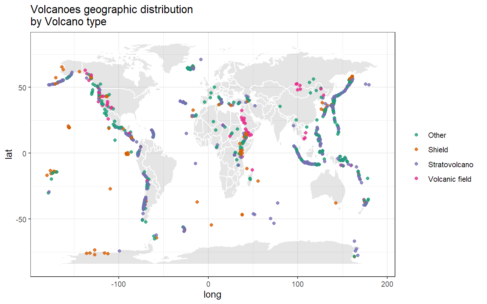
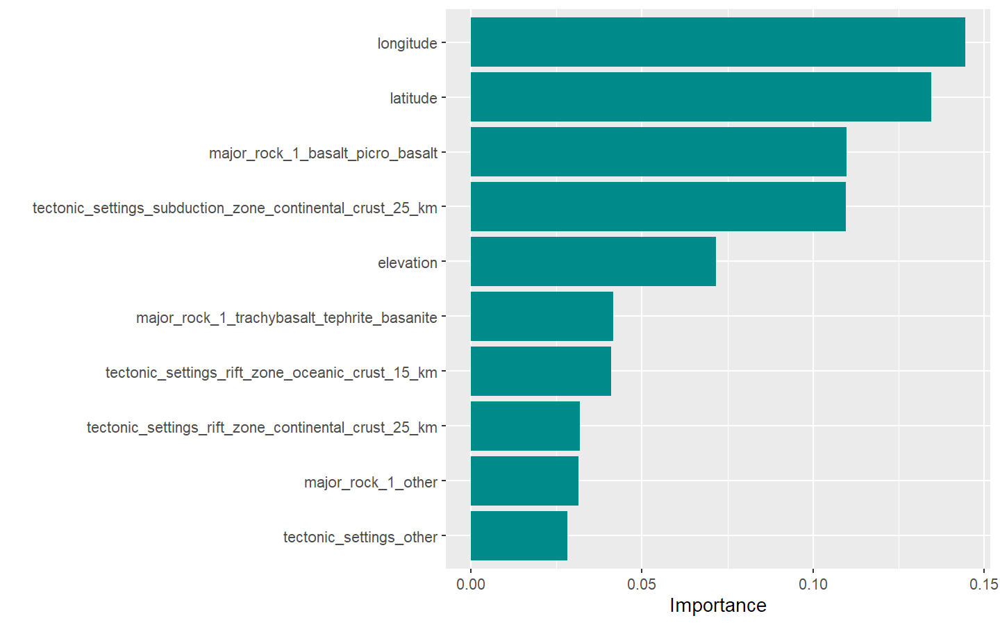
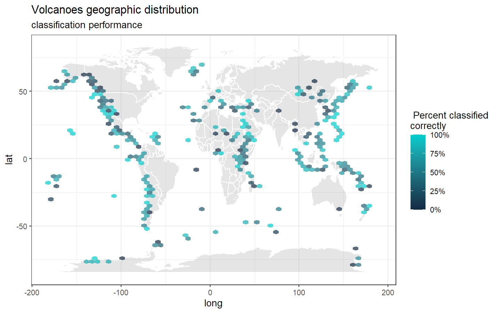

README
================

## Get the data from [Volcano](https://github.com/rfordatascience/tidytuesday/tree/master/data/2020/2020-05-12) data from TidyTuesday 2020-05-12.

``` r
Volcano<- readr::read_csv("https://raw.githubusercontent.com/rfordatascience/tidytuesday/master/data/2020/2020-05-12/volcano.csv")

Volcano
```

    ## # A tibble: 958 x 26
    ##    volcano_number volcano_name primary_volcano~ last_eruption_y~ country region
    ##             <dbl> <chr>        <chr>            <chr>            <chr>   <chr> 
    ##  1         283001 Abu          Shield(s)        -6850            Japan   Japan~
    ##  2         355096 Acamarachi   Stratovolcano    Unknown          Chile   South~
    ##  3         342080 Acatenango   Stratovolcano(e~ 1972             Guatem~ Méxic~
    ##  4         213004 Acigol-Nevs~ Caldera          -2080            Turkey  Medit~
    ##  5         321040 Adams        Stratovolcano    950              United~ Canad~
    ##  6         283170 Adatarayama  Stratovolcano(e~ 1996             Japan   Japan~
    ##  7         221170 Adwa         Stratovolcano    Unknown          Ethiop~ Afric~
    ##  8         221110 Afdera       Stratovolcano    Unknown          Ethiop~ Afric~
    ##  9         284160 Agrigan      Stratovolcano    1917             United~ Japan~
    ## 10         342100 Agua         Stratovolcano    Unknown          Guatem~ Méxic~
    ## # ... with 948 more rows, and 20 more variables: subregion <chr>,
    ## #   latitude <dbl>, longitude <dbl>, elevation <dbl>, tectonic_settings <chr>,
    ## #   evidence_category <chr>, major_rock_1 <chr>, major_rock_2 <chr>,
    ## #   major_rock_3 <chr>, major_rock_4 <chr>, major_rock_5 <chr>,
    ## #   minor_rock_1 <chr>, minor_rock_2 <chr>, minor_rock_3 <chr>,
    ## #   minor_rock_4 <chr>, minor_rock_5 <chr>, population_within_5_km <dbl>,
    ## #   population_within_10_km <dbl>, population_within_30_km <dbl>,
    ## #   population_within_100_km <dbl>

## Explore the Volcano dataset.

``` r
Volcano %>% 
  count(primary_volcano_type, 
        sort = T) %>% 
  knitr::kable()
```

| primary\_volcano\_type |   n |
| :--------------------- | --: |
| Stratovolcano          | 353 |
| Stratovolcano(es)      | 107 |
| Shield                 |  85 |
| Volcanic field         |  71 |
| Pyroclastic cone(s)    |  70 |
| Caldera                |  65 |
| Complex                |  46 |
| Shield(s)              |  33 |
| Submarine              |  27 |
| Lava dome(s)           |  26 |
| Fissure vent(s)        |  12 |
| Caldera(s)             |   9 |
| Compound               |   9 |
| Maar(s)                |   8 |
| Pyroclastic shield     |   7 |
| Tuff cone(s)           |   7 |
| Crater rows            |   5 |
| Subglacial             |   5 |
| Pyroclastic cone       |   4 |
| Lava dome              |   3 |
| Complex(es)            |   1 |
| Lava cone              |   1 |
| Lava cone(es)          |   1 |
| Lava cone(s)           |   1 |
| Stratovolcano?         |   1 |
| Tuff cone              |   1 |

Here we see the different types of volcano classes, maybe we can do a
MultiClass Classification (multinomial) to determine the type of
volcano.

26 classes is too much for under 1000 registries, so we can reduce the
classes to a few less to work.

``` r
Volcano_df<- Volcano %>% 
  transmute(volcano_type= case_when(str_detect(primary_volcano_type,
                                               "Stratovolcano") ~ "Stratovolcano  ",
                                    str_detect(primary_volcano_type, "Shield") ~ "Shield",
                                    str_detect(primary_volcano_type, "Volcanic field") ~ "Volcanic field", 
                                    TRUE ~"Other"),
            volcano_number, latitude, longitude, 
            elevation, tectonic_settings, major_rock_1) %>% 
  mutate_if(is.character, factor)
```

Let’s see the spatial distribution of the volcanoes

``` r
world<- map_data("world")

ggplot()+
  geom_map(data= world, map= world,
           aes(long, lat, map_id = region), 
               color= "white", fill= "gray50", alpha= 0.2)+
  geom_point(data= Volcano_df,
             aes(longitude, latitude, color= volcano_type), 
             alpha= 0.8)+ 
  scale_color_brewer(palette="Dark2")+
  labs(title= "Volcanoes geographic distribution\nby Volcano type")+
  theme_bw()+
  theme(legend.title = element_blank())
```

<!-- -->

## Modeling Proces.

There is no sufficient data to split into train and test, so we can do a
bootstrap

``` r
library(tidymodels)

Volcano_boot<- bootstraps(Volcano_df)
Volcano_boot
```

    ## # Bootstrap sampling 
    ## # A tibble: 25 x 2
    ##    splits            id         
    ##    <list>            <chr>      
    ##  1 <split [958/347]> Bootstrap01
    ##  2 <split [958/347]> Bootstrap02
    ##  3 <split [958/364]> Bootstrap03
    ##  4 <split [958/357]> Bootstrap04
    ##  5 <split [958/346]> Bootstrap05
    ##  6 <split [958/369]> Bootstrap06
    ##  7 <split [958/357]> Bootstrap07
    ##  8 <split [958/345]> Bootstrap08
    ##  9 <split [958/334]> Bootstrap09
    ## 10 <split [958/353]> Bootstrap10
    ## # ... with 15 more rows

``` r
Volcano_df %>% 
  count(volcano_type)
```

    ## # A tibble: 4 x 2
    ##   volcano_type          n
    ##   <fct>             <int>
    ## 1 "Other"             308
    ## 2 "Shield"            118
    ## 3 "Stratovolcano  "   461
    ## 4 "Volcanic field"     71

The number of each type of volcanoes is too unbalanced so we have to
deal with it with a SMOTE algorithm of the
[themis](https://github.com/tidymodels/themis) library.

To do this first we have create a Dummy variable to transform the
factors to numeric and center scale the numeric variables.

``` r
Volcano_df %>% 
  count(tectonic_settings) #too much categories!
```

    ## # A tibble: 11 x 2
    ##    tectonic_settings                                   n
    ##    <fct>                                           <int>
    ##  1 Intraplate / Continental crust (>25 km)           106
    ##  2 Intraplate / Intermediate crust (15-25 km)          4
    ##  3 Intraplate / Oceanic crust (< 15 km)               14
    ##  4 Rift zone / Continental crust (>25 km)             74
    ##  5 Rift zone / Intermediate crust (15-25 km)          21
    ##  6 Rift zone / Oceanic crust (< 15 km)                69
    ##  7 Subduction zone / Continental crust (>25 km)      511
    ##  8 Subduction zone / Crustal thickness unknown        40
    ##  9 Subduction zone / Intermediate crust (15-25 km)    41
    ## 10 Subduction zone / Oceanic crust (< 15 km)          77
    ## 11 Unknown                                             1

``` r
Volcano_df %>% 
  count(tectonic_settings) #Same, too much categories!
```

    ## # A tibble: 11 x 2
    ##    tectonic_settings                                   n
    ##    <fct>                                           <int>
    ##  1 Intraplate / Continental crust (>25 km)           106
    ##  2 Intraplate / Intermediate crust (15-25 km)          4
    ##  3 Intraplate / Oceanic crust (< 15 km)               14
    ##  4 Rift zone / Continental crust (>25 km)             74
    ##  5 Rift zone / Intermediate crust (15-25 km)          21
    ##  6 Rift zone / Oceanic crust (< 15 km)                69
    ##  7 Subduction zone / Continental crust (>25 km)      511
    ##  8 Subduction zone / Crustal thickness unknown        40
    ##  9 Subduction zone / Intermediate crust (15-25 km)    41
    ## 10 Subduction zone / Oceanic crust (< 15 km)          77
    ## 11 Unknown                                             1

### Preprocesing.

Let’s make the recipe\!

``` r
library(themis)

Volcano_rec<-recipe(volcano_type ~ ., data= Volcano_df ) %>% #Predict Volcano type with everything else
  update_role(volcano_number, new_role = "Id") %>% 
  step_other(tectonic_settings) %>%  #collapses the most infrequent levels to "Other"
  step_other(major_rock_1) %>% #same as before
  step_dummy(tectonic_settings, major_rock_1) %>%  #creates Dummy variables
  step_zv(all_predictors()) %>% #remove variables with zero variance
  step_normalize(all_predictors()) %>% #centerscale all predictors
  step_smote(volcano_type) #generate new examples of the minority class using nearest neighbors of these cases
  
Volcano_prep<- prep(Volcano_rec) #train the recipe
Volcano_prep
```

    ## Data Recipe
    ## 
    ## Inputs:
    ## 
    ##       role #variables
    ##         Id          1
    ##    outcome          1
    ##  predictor          5
    ## 
    ## Training data contained 958 data points and no missing data.
    ## 
    ## Operations:
    ## 
    ## Collapsing factor levels for tectonic_settings [trained]
    ## Collapsing factor levels for major_rock_1 [trained]
    ## Dummy variables from tectonic_settings, major_rock_1 [trained]
    ## Zero variance filter removed no terms [trained]
    ## Centering and scaling for latitude, longitude, ... [trained]
    ## SMOTE based on volcano_type [trained]

Notice how many new info we have, the new rows are because the
oversampling and columns by the new Dummy variables

``` r
juice(Volcano_prep)
```

    ## # A tibble: 1,844 x 14
    ##    volcano_number latitude longitude elevation volcano_type tectonic_settin~
    ##             <dbl>    <dbl>     <dbl>     <dbl> <fct>                   <dbl>
    ##  1         213004   0.746      0.101   -0.131  Other                  -0.289
    ##  2         284141   0.172      1.11    -1.39   Other                  -0.289
    ##  3         282080   0.526      0.975   -0.535  Other                  -0.289
    ##  4         285070   0.899      1.10    -0.263  Other                  -0.289
    ##  5         221060  -0.0377     0.155   -0.920  Other                  -0.289
    ##  6         273088   0.0739     0.888    0.330  Other                  -0.289
    ##  7         266020  -0.451      0.918   -0.0514 Other                  -0.289
    ##  8         257040  -0.989      1.32    -0.380  Other                  -0.289
    ##  9         354004  -0.963     -0.873    2.03   Other                  -0.289
    ## 10         312090   1.33      -1.65    -0.375  Other                  -0.289
    ## # ... with 1,834 more rows, and 8 more variables:
    ## #   tectonic_settings_Rift.zone...Oceanic.crust....15.km. <dbl>,
    ## #   tectonic_settings_Subduction.zone...Continental.crust...25.km. <dbl>,
    ## #   tectonic_settings_Subduction.zone...Oceanic.crust....15.km. <dbl>,
    ## #   tectonic_settings_other <dbl>, major_rock_1_Basalt...Picro.Basalt <dbl>,
    ## #   major_rock_1_Dacite <dbl>,
    ## #   major_rock_1_Trachybasalt...Tephrite.Basanite <dbl>,
    ## #   major_rock_1_other <dbl>

``` r
juice(Volcano_prep) %>% 
  count(volcano_type) %>% #same number of observations by the oversampling of step_ smote()
  knitr::kable()
```

| volcano\_type  |   n |
| :------------- | --: |
| Other          | 461 |
| Shield         | 461 |
| Stratovolcano  | 461 |
| Volcanic field | 461 |

### Build a model.

First let’s try a Random forest

Advantages: - Is versatile, can be used for prediction and
classification problems - No need to fine tuning parameters with a
significant number of trees

we are going to fit a model using the advantages of
[TidyModels](https://www.tidymodels.org/), using the
[ranger](https://rdrr.io/cran/ranger/man/ranger.html) engine, a fastest
implementation of Random Forest algorithm, and setting a workflow

``` r
rf_spec<-
  rand_forest(trees=1000) %>%
  set_mode("classification") %>% 
  set_engine("ranger")

Volcano_wf<- 
  workflow() %>% 
  add_recipe(Volcano_rec) %>% 
  add_model(rf_spec)

Volcano_wf
```

    ## == Workflow ====================================================
    ## Preprocessor: Recipe
    ## Model: rand_forest()
    ## 
    ## -- Preprocessor ------------------------------------------------
    ## 6 Recipe Steps
    ## 
    ## * step_other()
    ## * step_other()
    ## * step_dummy()
    ## * step_zv()
    ## * step_normalize()
    ## * step_smote()
    ## 
    ## -- Model -------------------------------------------------------
    ## Random Forest Model Specification (classification)
    ## 
    ## Main Arguments:
    ##   trees = 1000
    ## 
    ## Computational engine: ranger

Results

``` r
Volcano_res<-
  fit_resamples(
  Volcano_wf,
  resamples= Volcano_boot, #we have 25 resamples 
  control= control_resamples(save_pred = TRUE)
)

Volcano_res
```

    ## # Resampling results
    ## # Bootstrap sampling 
    ## # A tibble: 25 x 5
    ##    splits           id          .metrics        .notes         .predictions     
    ##    <list>           <chr>       <list>          <list>         <list>           
    ##  1 <split [958/347~ Bootstrap01 <tibble [2 x 3~ <tibble [0 x ~ <tibble [347 x 7~
    ##  2 <split [958/347~ Bootstrap02 <tibble [2 x 3~ <tibble [0 x ~ <tibble [347 x 7~
    ##  3 <split [958/364~ Bootstrap03 <tibble [2 x 3~ <tibble [0 x ~ <tibble [364 x 7~
    ##  4 <split [958/357~ Bootstrap04 <tibble [2 x 3~ <tibble [0 x ~ <tibble [357 x 7~
    ##  5 <split [958/346~ Bootstrap05 <tibble [2 x 3~ <tibble [0 x ~ <tibble [346 x 7~
    ##  6 <split [958/369~ Bootstrap06 <tibble [2 x 3~ <tibble [0 x ~ <tibble [369 x 7~
    ##  7 <split [958/357~ Bootstrap07 <tibble [2 x 3~ <tibble [0 x ~ <tibble [357 x 7~
    ##  8 <split [958/345~ Bootstrap08 <tibble [2 x 3~ <tibble [0 x ~ <tibble [345 x 7~
    ##  9 <split [958/334~ Bootstrap09 <tibble [2 x 3~ <tibble [0 x ~ <tibble [334 x 7~
    ## 10 <split [958/353~ Bootstrap10 <tibble [2 x 3~ <tibble [0 x ~ <tibble [353 x 7~
    ## # ... with 15 more rows

## Explore the results

Look that the estimators are adjusted to a classification problem

``` r
Volcano_res %>% 
  collect_metrics() %>% 
  knitr::kable()
```

| .metric  | .estimator |      mean |  n |  std\_err |
| :------- | :--------- | --------: | -: | --------: |
| accuracy | multiclass | 0.6074620 | 25 | 0.0048348 |
| roc\_auc | hand\_till | 0.7942961 | 25 | 0.0037265 |

The classification don’t perform very well, just above the random
probabilities but maybe influenced by the small dataset…

``` r
Volcano_res %>% 
  collect_predictions() %>% 
  conf_mat(volcano_type, .pred_class)
```

    ##                  Truth
    ## Prediction        Other Shield Stratovolcano   Volcanic field
    ##   Other            1273    225             724            149
    ##   Shield            228    548             216             49
    ##   Stratovolcano    1080    215            3171             99
    ##   Volcanic field    260     99              79            306

Positive predictive value
[Wikipedia](https://en.wikipedia.org/wiki/Positive_and_negative_predictive_values)

``` r
Volcano_res %>% 
  collect_predictions() %>% 
  ppv(volcano_type, .pred_class) %>% 
  knitr::kable()
```

| .metric | .estimator | .estimate |
| :------ | :--------- | --------: |
| ppv     | macro      | 0.5423111 |

### Now let’s explore the variable importance

``` r
library(vip)
rf_spec %>% 
  set_engine("ranger", 
             importance= "permutation") %>% 
  fit(
    volcano_type ~ ., 
    data= juice(Volcano_prep) %>%
    select(-volcano_number) %>% 
    janitor:: clean_names() 
  ) %>% 
  vip(geom="col",fill="cyan4")
```

<!-- --> it’s clear
that the longitude and latitude are the most important variables of the
classification process

## Now a final map

``` r
Volcano_predictions<- 
  Volcano_res %>% 
  collect_predictions() %>% 
  mutate(Correct = volcano_type == .pred_class) %>% 
  left_join(Volcano_df %>% 
              mutate(.row= row_number()))
Volcano_predictions
```

    ## # A tibble: 8,721 x 15
    ##    id    .pred_Other .pred_Shield `.pred_Stratovo~ `.pred_Volcanic~  .row
    ##    <chr>       <dbl>        <dbl>            <dbl>            <dbl> <int>
    ##  1 Boot~       0.579       0.131             0.257           0.0334     1
    ##  2 Boot~       0.182       0.0578            0.627           0.133      3
    ##  3 Boot~       0.358       0.0752            0.514           0.0531     4
    ##  4 Boot~       0.297       0.0744            0.607           0.0220     6
    ##  5 Boot~       0.184       0.0565            0.632           0.128     10
    ##  6 Boot~       0.425       0.0198            0.522           0.0326    13
    ##  7 Boot~       0.630       0.0726            0.273           0.0246    15
    ##  8 Boot~       0.535       0.0516            0.388           0.0252    20
    ##  9 Boot~       0.359       0.194             0.384           0.0628    23
    ## 10 Boot~       0.134       0.232             0.509           0.125     24
    ## # ... with 8,711 more rows, and 9 more variables: .pred_class <fct>,
    ## #   volcano_type <fct>, Correct <lgl>, volcano_number <dbl>, latitude <dbl>,
    ## #   longitude <dbl>, elevation <dbl>, tectonic_settings <fct>,
    ## #   major_rock_1 <fct>

``` r
ggplot()+
  geom_map(data=world,map=world,
           aes(long, lat, map_id= region),
           color="white", fill="gray50", alpha=0.2)+
  stat_summary_hex(data= Volcano_predictions, 
                   aes(longitude, latitude, z= as.integer(Correct)),
                   fun= "mean", alpha= 0.7, bins= 60)+
  scale_fill_gradient(high= "cyan3", labels= scales::percent)+
  theme_bw()+
  labs(title= "Volcanoes geographic distribution",
       subtitle= "classification performance",
       fill=" Percent classified \ncorrectly")
```

<!-- -->
